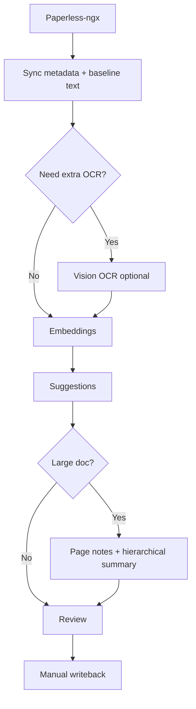

# Paperless-NGX Cortex

Paperless-NGX Cortex is a separate intelligence layer for Paperless-ngx. It keeps Paperless as the source of truth, processes documents locally (sync, OCR layers, embeddings, suggestions), and supports explicit manual writeback only.

## What this project is (and why it exists)
I built this because Paperless-ngx is excellent at storage and search, but I wanted a focused intelligence layer that can be audited, resumed, and controlled without ever auto-writing back. The goal is to make document understanding and metadata suggestions fast, local, and reviewable.

### Friendly reminder
This started as personal project and is heavy biased towards my personal home setup. I thought, maybe the code, prompts, techniques or else could be useful for someone out there, looking to achieve similar.

## Benefits
- Keeps Paperless-ngx as the source of truth and never auto-writes.
- Adds local OCR quality checks and optional vision OCR without overwriting the baseline.
- Produces embeddings, semantic search, suggestions, and summaries you can review before applying.
- Handles large documents with resumable, observable pipeline steps.
- Adds per-document chat with follow-up question suggestions.
- Surfaces similar documents and potential duplicates from embeddings.

## Processing diagram


## Current status
### Delivery phases
- `MVP` (core intelligence layer): **Done**
  - Sync from Paperless, local storage, embeddings, semantic search, suggestions, queue/worker, manual writeback.
- `Phase 1` (robustness + UX streamlining): **Done**
  - Pipeline hardening + triage/log observability baseline delivered.
- `Phase 2` (advanced evidence locator / on-the-fly bbox resolution): **Planned / partial design only**
  - Spec exists, full implementation not complete yet.

### Practical interpretation
- You can use the app end-to-end today.
- Current engineering focus is quality and reliability, not greenfield features.

## Product principles
- No automatic writeback to Paperless.
- All AI outputs are reviewed locally first.
- Writeback is explicit and manual.
- Local processing should be resumable, observable, and robust for large docs.

## Core flow (current)
1. Sync metadata + text baseline from Paperless.
2. Optionally run vision OCR as additional layer (never overwrite baseline).
3. Generate embeddings (paperless and/or vision source strategy).
4. Generate suggestions (paperless/vision + best pick).
5. For large docs: page notes + hierarchical summary.
6. Review locally, then explicitly write back selected fields.

Per-document operations also allow targeted manual re-runs for individual steps (for example `similarity_index`) without forcing a full reset/reprocess.

## Requirements and installation
### Prerequisites
- Python `>=3.13` for the backend.
- Node.js `>=18` for the frontend.
- Paperless-ngx instance reachable by URL and API token.
- Postgres, Redis, and a supported vector store (`Qdrant` or `Weaviate`) (local installs or Docker).
- An OpenAI-compatible LLM endpoint (local or remote).
For user-facing operations and UI guidance, see [`docs/manual/README.md`](E:/workspace/python/paperless-intelligence/docs/manual/README.md).

### Backend (recommended: uv)
```bash
cd backend
uv sync
uv run alembic upgrade head
uv run uvicorn app.main:app --reload --port 8000
```

### Backend (pip + requirements.txt)
A pinned `requirements.txt` is generated at `backend/requirements.txt`.

```bash
cd backend
python -m venv .venv
source .venv/bin/activate
pip install -r requirements.txt
alembic upgrade head
uvicorn app.main:app --reload --port 8000
```

To refresh `requirements.txt` from `pyproject.toml`:
```bash
cd backend
uv export --format requirements.txt --no-dev --output-file requirements.txt
```

### Worker (optional, queue mode)
```bash
cd backend
uv run python -m app.worker
```

### Frontend
```bash
cd frontend
npm install
npm run dev
```

## Local setup (database + migrations)
1. Copy `.env.example` to `.env` and fill values. Do not commit `.env` to GitHub.
2. Ensure Postgres, Redis, and your active vector store are running.
3. Create the database specified by `DATABASE_URL`.
4. Run migrations with Alembic.

Example Postgres setup:
```bash
createdb paperless_intelligence
createuser paperless
```

Example migrations:
```bash
cd backend
uv run alembic upgrade head
```

## Docker
### App-only (backend + frontend + redis)
```bash
docker compose -f docker-compose.app.yml up --build
```

### Full stack (app + postgres + redis + qdrant)
```bash
docker compose -f docker-compose.full.yml up --build
```
**Important:** `LLM_BASE_URL` must be set in your `.env`. It is not set in `docker-compose.full.yml`.
Docker uses `:8000` for the API and serves the frontend from the backend container unless you run the frontend dev server separately.

### Worker-only container
```bash
docker compose -f docker-compose.worker.yml up --build
```

## Configuration
Set values in `.env`.

### Minimum for a real setup
- `PAPERLESS_BASE_URL`
- `PAPERLESS_API_TOKEN`
- `DATABASE_URL`
- `VECTOR_STORE_PROVIDER`
- vector-store-specific settings for Qdrant or Weaviate
- `LLM_BASE_URL`
- `TEXT_MODEL`
- `EMBEDDING_MODEL`

### Configuration docs
- [`.env.example`](E:/workspace/python/paperless-intelligence/.env.example) for concrete environment variables and example values
- [`docs/config-reference.md`](E:/workspace/python/paperless-intelligence/docs/config-reference.md) for grouped runtime configuration guidance
- [`docs/architecture-overview.md`](E:/workspace/python/paperless-intelligence/docs/architecture-overview.md) for the technical component overview

## Documentation map

### For users
- [`MANUAL.md`](E:/workspace/python/paperless-intelligence/MANUAL.md): documentation entry point
- [`docs/manual/README.md`](E:/workspace/python/paperless-intelligence/docs/manual/README.md): end-user manual
- [`docs/manual/14-tages-checkliste.md`](E:/workspace/python/paperless-intelligence/docs/manual/14-tages-checkliste.md): daily checklist
- [`docs/manual/12-similar-workflow.md`](E:/workspace/python/paperless-intelligence/docs/manual/12-similar-workflow.md): similar-doc review workflow
- [`docs/manual/13-team-policy.md`](E:/workspace/python/paperless-intelligence/docs/manual/13-team-policy.md): concise working rules

### For admins and operators
- [`docs/manual/15-admin-und-betrieb.md`](E:/workspace/python/paperless-intelligence/docs/manual/15-admin-und-betrieb.md): admin and UI operations guide
- [`docs/manual/16-settings-und-live-model-provider.md`](E:/workspace/python/paperless-intelligence/docs/manual/16-settings-und-live-model-provider.md): live model-provider settings and API-key behavior
- [`docs/architecture-overview.md`](E:/workspace/python/paperless-intelligence/docs/architecture-overview.md): architecture overview
- [`docs/config-reference.md`](E:/workspace/python/paperless-intelligence/docs/config-reference.md): grouped configuration reference

### For developers and contributors
- [`CHANGELOG.md`](E:/workspace/python/paperless-intelligence/CHANGELOG.md): granular change history
- [`agents.md`](E:/workspace/python/paperless-intelligence/agents.md): compact project state and next actions
- [`CONTRIBUTING.md`](E:/workspace/python/paperless-intelligence/CONTRIBUTING.md): contribution notes
- [`docs/execution-blueprint-large-doc-worker.md`](E:/workspace/python/paperless-intelligence/docs/execution-blueprint-large-doc-worker.md): large-document worker strategy

## API/client generation
```bash
cd frontend
ORVAL_API_URL=http://localhost:8000/api/openapi.json npm run api:generate
```

## Versioning (simple start, no CI)
The root `VERSION` file is the source of truth.

```bash
python scripts/sync_version.py
```

This synchronizes:
- `backend/pyproject.toml`
- `frontend/package.json`
- `frontend/src/generated/version.ts`

`GET /api/status` exposes `app_version`, `api_version`, and `frontend_version`; the frontend footer renders them.

## License
MIT License. See `LICENSE`.
Provided “as is”, without warranty of any kind.
